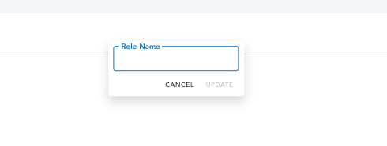

# Editable Component

This project demonstrates a simple Vue 2 component, `Editable`, which can be used for creating text and select inputs. Below are examples of the `Editable` component in action.

## Text Input

The text input allows users to enter and edit a text value. When the input is in focus, the user can type in their desired text. The component provides "Cancel" and "Update" buttons to either discard or save the changes.



## Select Input

The select input allows users to choose from a predefined list of options. When the input is clicked, a dropdown menu appears with the available options. The user can select an option from the dropdown menu.


## Usage

To use the `Editable` component in your Vue project, follow these steps:

1. **Clone the repository:**

   ```sh
   git clone https://github.com/your-username/your-repo-name.git
   cd your-repo-name
